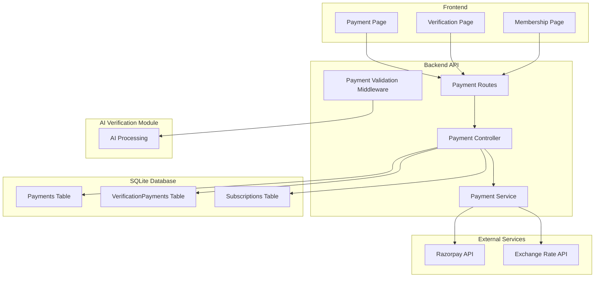
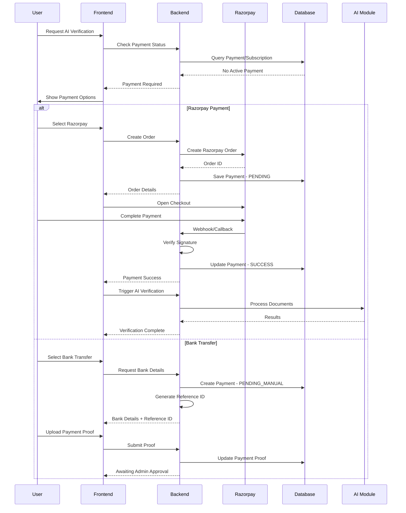
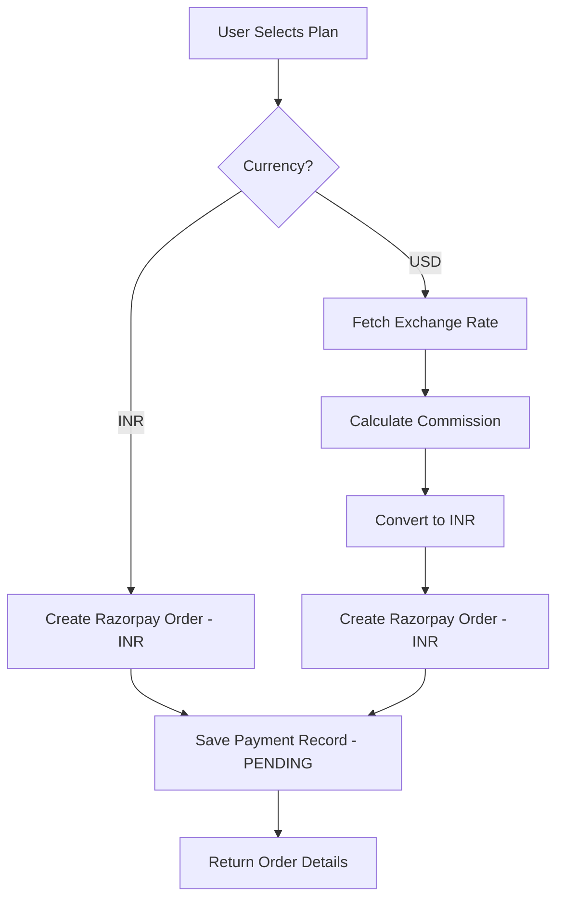
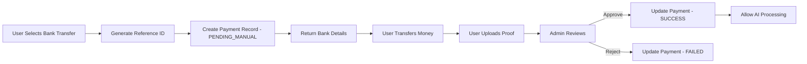
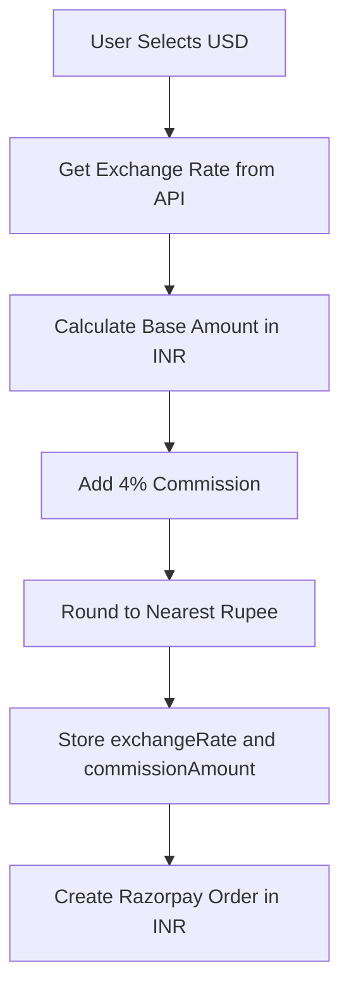

# Payment System Implementation Plan

## Overview

This document outlines the complete implementation plan for integrating a production-ready payment system into the Vijayalakshmi Boyar Matrimony project. The system will support Razorpay (Credit Card, Debit Card, UPI, Net Banking, Wallet), Direct Bank Transfer, and International payments.

---

## 1. System Architecture

### 1.1 High-Level Architecture



### 1.2 Payment Flow Diagram



---

## 2. Database Schema Changes

### 2.1 New Prisma Models

#### Payments Model

```prisma
model Payments {
  id              String   @id @default(cuid())
  userId          String   @map("user_id")
  orderId         String   @unique @map("order_id")      // Razorpay Order ID or Internal Reference
  paymentId       String?  @map("payment_id")            // Razorpay Payment ID
  amountINR       Float    @map("amount_inr")            // Final amount in INR
  currency        String   @default("INR")
  paymentMethod   String   @map("payment_method")        // RAZORPAY, BANK_TRANSFER
  paymentStatus   String   @default("PENDING") @map("payment_status") // PENDING, SUCCESS, FAILED, PENDING_MANUAL
  international   Boolean  @default(false)
  exchangeRate    Float?   @map("exchange_rate")         // USD to INR rate
  commissionAmount Float?  @map("commission_amount")     // Currency conversion commission
  originalAmount  Float?   @map("original_amount")       // Original amount in foreign currency
  paymentProof    String?  @map("payment_proof")         // Bank transfer proof URL
  referenceId     String?  @map("reference_id")          // Unique reference for bank transfer
  verifiedBy      String?  @map("verified_by")           // Admin who verified manual payment
  verifiedAt      DateTime? @map("verified_at")
  createdAt       DateTime @default(now()) @map("created_at")
  updatedAt       DateTime @updatedAt @map("updated_at")
  
  user            User     @relation("UserPayments", fields: [userId], references: [id], onDelete: Cascade)
  
  @@map("payments")
}
```

#### VerificationPayments Model

```prisma
model VerificationPayments {
  id               String   @id @default(cuid())
  userId           String   @map("user_id")
  paymentId        String?  @map("payment_id")           // Link to Payments table
  amount           Float
  paymentStatus    String   @default("PENDING") @map("payment_status") // PENDING, SUCCESS, FAILED
  verificationType String   @map("verification_type")    // BASIC_AI, ADVANCED_AI
  razorpayOrderId  String?  @map("razorpay_order_id")
  razorpayPaymentId String? @map("razorpay_payment_id")
  createdAt        DateTime @default(now()) @map("created_at")
  updatedAt        DateTime @updatedAt @map("updated_at")
  
  user             User     @relation("UserVerificationPayments", fields: [userId], references: [id], onDelete: Cascade)
  
  @@map("verification_payments")
}
```

### 2.2 Updated User Model Relations

```prisma
model User {
  // ... existing fields ...
  
  // Relations - Add these
  payments              Payments[]              @relation("UserPayments")
  verificationPayments  VerificationPayments[]  @relation("UserVerificationPayments")
}
```

---

## 3. Backend Implementation

### 3.1 File Structure

```
backend/
├── config/
│   └── payments.js           # Payment configuration
├── controllers/
│   └── paymentController.js  # Payment endpoints
├── middleware/
│   └── paymentValidation.js  # Payment verification middleware
├── routes/
│   └── payments.js           # Payment routes
├── services/
│   ├── razorpayService.js    # Razorpay integration
│   ├── exchangeRateService.js # Currency conversion
│   └── paymentService.js     # Payment business logic
└── utils/
    └── paymentUtils.js       # Payment utilities
```

### 3.2 API Endpoints

| Method | Endpoint | Description |
|--------|----------|-------------|
| POST | `/api/payments/create-order` | Create Razorpay order |
| POST | `/api/payments/verify` | Verify Razorpay payment |
| POST | `/api/payments/webhook` | Razorpay webhook handler |
| POST | `/api/payments/bank-transfer` | Initiate bank transfer |
| POST | `/api/payments/bank-transfer/proof` | Upload payment proof |
| GET | `/api/payments/status/:userId` | Get payment status |
| GET | `/api/payments/verification/:userId` | Check verification payment |
| POST | `/api/admin/payments/approve/:id` | Admin approve manual payment |
| GET | `/api/admin/payments/pending` | Get pending manual payments |

### 3.3 Payment Validation Middleware

```javascript
// middleware/paymentValidation.js
const validatePaymentForAI = async (req, res, next) => {
  const userId = req.user.id;
  
  // Check 1: Active Subscription
  const activeSubscription = await prisma.subscription.findFirst({
    where: { userId, status: 'ACTIVE', endDate: { gte: new Date() } }
  });
  
  if (activeSubscription) {
    return next(); // Allow AI processing
  }
  
  // Check 2: Successful Verification Payment
  const verificationPayment = await prisma.verificationPayments.findFirst({
    where: { userId, paymentStatus: 'SUCCESS' }
  });
  
  if (verificationPayment) {
    return next(); // Allow AI processing
  }
  
  // No valid payment - return payment required
  return res.status(402).json({
    error: 'Payment required',
    message: 'Please complete payment to proceed with AI verification',
    paymentRequired: true
  });
};
```

---

## 4. Razorpay Integration

### 4.1 Configuration

```javascript
// config/payments.js
module.exports = {
  razorpay: {
    keyId: process.env.RAZORPAY_KEY_ID,
    keySecret: process.env.RAZORPAY_KEY_SECRET,
    webhookSecret: process.env.RAZORPAY_WEBHOOK_SECRET
  },
  bankDetails: {
    accountHolderName: 'Vijayalakshmi',
    bankName: 'State Bank of India (SBI)',
    accountNumber: '42238903895',
    ifscCode: 'SBIN0064593',
    branch: 'Uppiliapuram',
    pinCode: '621011'
  },
  verificationPricing: {
    BASIC_AI: 199,    // INR
    ADVANCED_AI: 499  // INR
  },
  international: {
    commissionPercentage: 4, // 4% commission for international payments
    supportedCurrencies: ['USD']
  }
};
```

### 4.2 Order Creation Flow



### 4.3 Signature Verification

```javascript
// Verify payment signature
const crypto = require('crypto');

const verifySignature = (orderId, paymentId, signature) => {
  const body = orderId + '|' + paymentId;
  const expectedSignature = crypto
    .createHmac('sha256', process.env.RAZORPAY_KEY_SECRET)
    .update(body.toString())
    .digest('hex');
  
  return expectedSignature === signature;
};
```

---

## 5. Direct Bank Transfer

### 5.1 Flow



### 5.2 Reference ID Generation

```javascript
// Format: VBM-YYYYMMDD-XXXXX
const generateReferenceId = () => {
  const date = new Date();
  const dateStr = date.toISOString().slice(0,10).replace(/-/g, '');
  const random = Math.random().toString(36).substring(2, 7).toUpperCase();
  return `VBM-${dateStr}-${random}`;
};
```

---

## 6. International Payments

### 6.1 Currency Conversion Flow



### 6.2 Exchange Rate API Integration

```javascript
// services/exchangeRateService.js
const axios = require('axios');

const getUsdToInrRate = async () => {
  // Using exchangerate-api.com or similar
  const response = await axios.get(
    `https://api.exchangerate-api.com/v4/latest/USD`
  );
  return response.data.rates.INR;
};
```

---

## 7. Admin Dashboard Updates

### 7.1 Payment Management Section

Add to admin panel:
- Pending manual payments queue
- Payment proof viewer
- Approve/Reject buttons
- Payment history per user

### 7.2 Verification Badge

```javascript
// Badge display logic
const getVerificationBadge = (verification) => {
  if (verification.aiStatus === 'APPROVE' && verification.paymentStatus === 'SUCCESS') {
    return 'AI Verified (Paid)';
  }
  return 'Manual Review';
};
```

---

## 8. Security Considerations

### 8.1 Security Checklist

| Item | Implementation |
|------|----------------|
| Secret Keys | Never expose to frontend, use environment variables |
| Signature Verification | Always verify Razorpay signature on backend |
| Webhook Verification | Verify webhook signature using shared secret |
| Payment Status | Never trust frontend payment status updates |
| Duplicate Prevention | Check for existing successful payment before creating new |
| Role-Based Access | Admin-only endpoints for manual payment approval |
| Audit Trail | Log all payment-related actions |

### 8.2 Webhook Security

```javascript
// Verify webhook signature
const verifyWebhook = (payload, signature) => {
  const expectedSignature = crypto
    .createHmac('sha256', process.env.RAZORPAY_WEBHOOK_SECRET)
    .update(JSON.stringify(payload))
    .digest('hex');
  
  return expectedSignature === signature;
};
```

---

## 9. Compliance

### 9.1 Indian IT Act & RBI Guidelines

- **PCI DSS Compliance**: Razorpay handles card data, we only receive tokens
- **Data Localization**: All data stored in India (SQLite/PostgreSQL on AWS Mumbai)
- **Transaction Limits**: Follow RBI guidelines for international transactions
- **KYC**: User verification before high-value transactions
- **Refund Policy**: Implement within 7 days as per RBI guidelines

### 9.2 Data Retention

- Payment records: 7 years (RBI requirement)
- Failed payments: 1 year
- Webhook logs: 1 year

---

## 10. Implementation Phases

### Phase 1: Database & Core Models
- [ ] Update Prisma schema with Payments and VerificationPayments models
- [ ] Run migration
- [ ] Create payment configuration file

### Phase 2: Razorpay Integration
- [ ] Install Razorpay SDK
- [ ] Create Razorpay service
- [ ] Implement order creation endpoint
- [ ] Implement signature verification
- [ ] Create webhook handler

### Phase 3: Payment Validation
- [ ] Create payment validation middleware
- [ ] Integrate with AI verification flow
- [ ] Add payment check before AI processing

### Phase 4: Direct Bank Transfer
- [ ] Implement reference ID generation
- [ ] Create bank transfer initiation endpoint
- [ ] Implement payment proof upload
- [ ] Create admin approval workflow

### Phase 5: International Payments
- [ ] Integrate exchange rate API
- [ ] Implement currency conversion
- [ ] Add commission calculation
- [ ] Test USD payments

### Phase 6: Admin Dashboard
- [ ] Add pending payments view
- [ ] Implement approve/reject functionality
- [ ] Add verification badge display
- [ ] Create payment history view

### Phase 7: Frontend Integration
- [ ] Create payment page UI
- [ ] Integrate Razorpay checkout
- [ ] Add bank transfer flow
- [ ] Update verification page

### Phase 8: Testing & Security
- [ ] Unit tests for payment service
- [ ] Integration tests for payment flow
- [ ] Security audit
- [ ] Load testing

---

## 11. Environment Variables

Add to `.env`:

```env
# Razorpay Configuration
RAZORPAY_KEY_ID=rzp_live_xxxxx
RAZORPAY_KEY_SECRET=xxxxx
RAZORPAY_WEBHOOK_SECRET=xxxxx

# Exchange Rate API
EXCHANGE_RATE_API_KEY=xxxxx
EXCHANGE_RATE_API_URL=https://api.exchangerate-api.com/v4

# Payment Settings
PAYMENT_COMMISSION_PERCENTAGE=4
INTERNATIONAL_PAYMENTS_ENABLED=true
```

---

## 12. Dependencies

Add to `package.json`:

```json
{
  "dependencies": {
    "razorpay": "^2.9.0",
    "axios": "^1.6.0",
    "crypto": "built-in"
  }
}
```

---

## 13. Error Handling

### Error Codes

| Code | Message | Action |
|------|---------|--------|
| PAY001 | Payment required | Redirect to payment |
| PAY002 | Payment verification failed | Retry payment |
| PAY003 | Payment already processed | Check status |
| PAY004 | Invalid payment method | Select valid method |
| PAY005 | Exchange rate unavailable | Retry or use INR |
| PAY006 | Webhook verification failed | Log and alert |

---

## 14. Monitoring & Logging

### Payment Events to Log

- Order created
- Payment initiated
- Payment success/failed
- Webhook received
- Manual payment approved/rejected
- Refund processed

### Alerts

- Failed webhook verification
- Payment verification failure
- Exchange rate API failure
- High volume of failed payments

---

## Summary

This implementation plan covers all aspects of the payment system:

1. **Database**: Two new models for comprehensive payment tracking
2. **Razorpay**: Full integration with order creation, verification, and webhooks
3. **Bank Transfer**: Manual payment workflow with admin approval
4. **International**: USD support with exchange rate conversion
5. **Security**: Signature verification, role-based access, audit trails
6. **Compliance**: RBI and IT Act guidelines followed

The modular architecture ensures clear separation between:
- Payment validation (middleware)
- Payment processing (services)
- AI verification (existing module)
- Admin approval (controllers)
